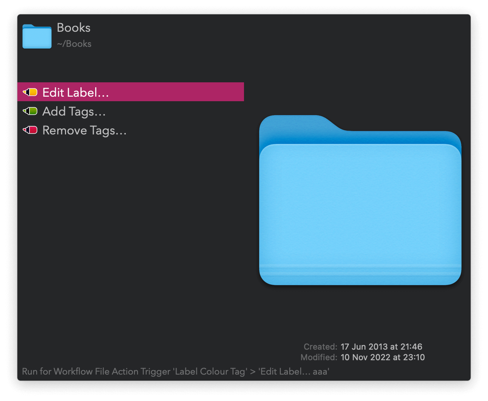
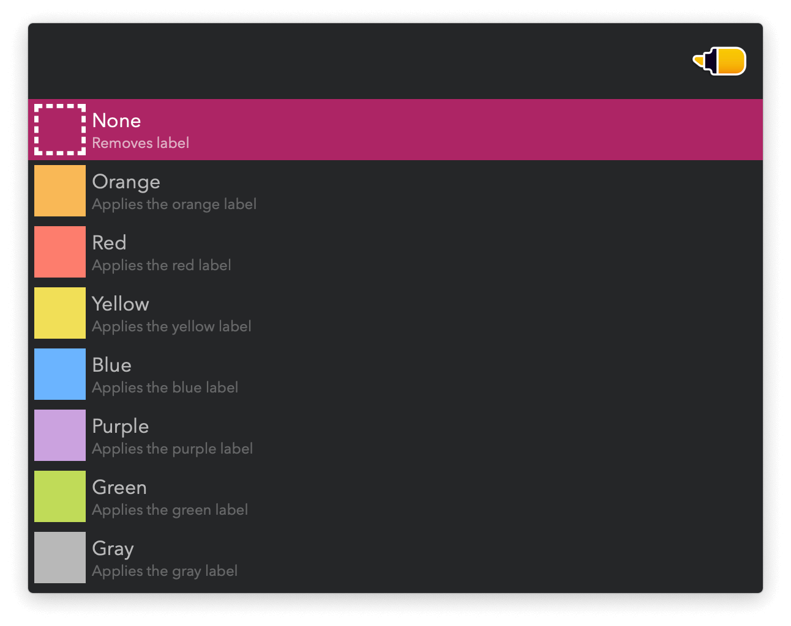
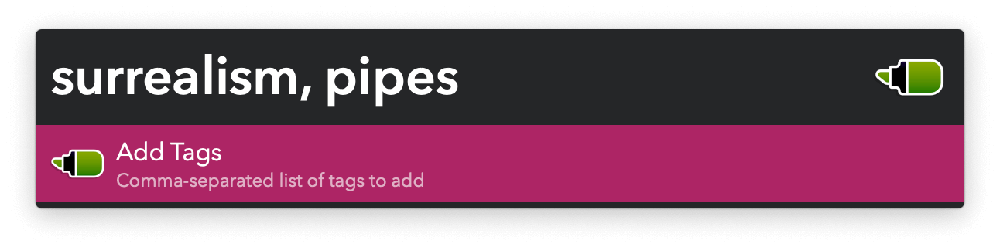
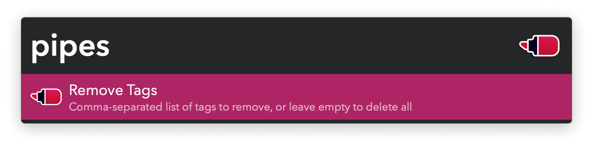

#  Label Colour Tag Alfred Workflow

Edit file labels and tags

[⤓ Install on the Alfred Gallery](https://alfred.app/workflows/vitor/label-colour-tag)

## Usage

Edit labels or add and remove tags from files and folders via the [Universal Actions](https://www.alfredapp.com/help/features/universal-actions/).

Alternatively, search for files and folders via the `label`, `tag add`, and `tag del` keywords or configure the [Hotkeys](https://www.alfredapp.com/help/workflows/triggers/hotkey/).
